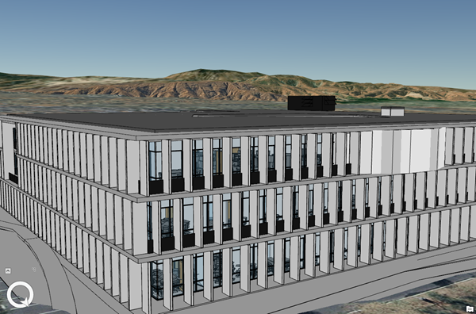

== Building Scene Layer (1.3)

Building content is often derived from Building Information Modeling (BIM) workflows. BIM is a best-practice process for optimizing design and construction. BIM processes can produce 3D virtual representations of real-world assets that are commonly used for construction, documentation, and evaluation. BIM processes are applied in multiple domains including architecture, buildings, energy, utilities, and transportation. A building scene layer can represent the 3D model content based on BIM structuring disciplines such as architectural or structural, and categories such as windows or walls.

*Examples*: Building Scene Layer example https://3dcities.maps.arcgis.com/home/item.html?id=3e6417f6544b422496a022f6e84aeaaa[SLPK]. Building Scene Layer example https://3dcities.maps.arcgis.com/home/item.html?id=bc11dd06a20546509679c1b3bc83380d[service].

_Example of a Building Scene Layer_

=== Building Scene Layer Structure

An I3S building scene layer contains discipline, such as architectural, and category layers, such as walls, as sublayers that represent a building and its assets. Building scene layers can be represented as a scene layer package (*.slpk) or an I3S service. A building scene layer contains the following:

* link:layer.bld.adoc[3DSceneLayer]
* link:sublayer.bld.adoc[sublayer]
* link:stats.bld.adoc[statistics]

=== Building Scene Layers and Filters

Building scene layers are visually complex. As such, being able to filter elements or parts of a building to see only the relevant or important information that you are looking for is very useful.

For example, if you want to see parts of a building that are on the second floor, you can set a filter to only show the second floor as solid. In other cases, you may be interested in seeing only the load barring walls on the second floor and show other elements on that floor as wireframe. You can achieve these different scenarios by applying a building filter to a building scene layer. You can choose one active filter at a time.

Using the I3S Filter Classes, the user can define a building filter. A building filter allows the user and/or client to make elements of a building visible as solid or wireframe. Each building filter contains one or many filter blocks. Filter blocks define what is visible in the building scene layer. Any filter mode created by other ArcGIS clients that is not set to the solid or wireframe type is shown as solid by default. For example, the Scene Viewer might have an x-ray filter mode. When visualizing a building with this filter mode the filter will be shown as solid.

=== Example of building scene scene layer structure

....
.<host>/SceneServer/layers
  +--0 // scene layer document
  |  +-- statistics
  |  |   +-- summary.json
  |  +-- sublayers
  |  |  +--0 // sublayer document
  |  |  |  +-- nodePages
  |  |  |  |  +-- 0
  |  |  |  |  +-- (...)
  |  |  |  +--nodes
  |  |  |  |  +--0
  |  |  |  |  |  +-- attributes
  |  |  |  |  |  |  +--f_2
  |  |  |  |  |  |  +--f_4
  |  |  |  |  |  |  +--(...)
  |  |  |  |  |  +-- geometries
  |  |  |  |  |  |  +-- 0
  |  |  |  |  |  +-- textures
  |  |  |  |  |  |  +-- 0
  |  |  |  |  |  |  +-- 0_0_1
  |  |  |  |  |  |  +--(...)
  |  |  |  |  |  +-- 3dNodeIndexDocument*
  |  |  |  |  |  +-- shared* 
  |  |  |  |  (...) 
  |  |  |  +--statistics
  |  |  |  | +-- f_2
  |  |  |  |  |  | +--0
  |  |  |  |  +-- f_4
  |  |  |  |  |  | +--0
  |  |  |  |  +-- (...)
....

_* Only required for 1.6 compatability for older clients._

== HTTP API Overview

The following API methods are available for Building Scene Layer:

*Scene Layer Document*

|===
|Type |JSON
|URL Template |http://serviceURL/layers/\{layerID}
|Example |http://my.server.com/BuildingSceneLayer/SceneServer/layers/0
|Description | This is the root document for the service that will contain properties common to the entire layer. layerID: Integer. ID of the associated layer.
|===

link:layer.bld.adoc[3DSceneLayer]

*Sublayer Document*

|===
|Type | JSON
|URL Template |http://serviceURL/layers/\{layerID}/sublayers/\{sublayerID}
|Example | http://my.server.com/BuildingSceneLayer/SceneServer/layers/0/sublayers/33 http://my.server.com/BuildingSceneLayer/SceneServer/layers/0/sublayers/33/nodes/0/geometries/0
|Description | Discipline or category layer. +
`layerID` Integer. ID of the associated layer. +
`sublayerID` Integer. ID of the associated resource.
|===

link:sublayer.bld.adoc[sublayer]

*Statistics*

|===
|Type | JSON
|URL Template | http://serviceURL/layers/\{layerID}/statistics/summary
|Example | http://my.server.com/3DObjectSceneLayer/SceneServer/layers/0/statistics/summary
|Description | The statistics for the entire layer for a specific attribute. +
`layerID` Integer. ID of the associated layer.
|===

link:stats.bld.adoc[statistics]
