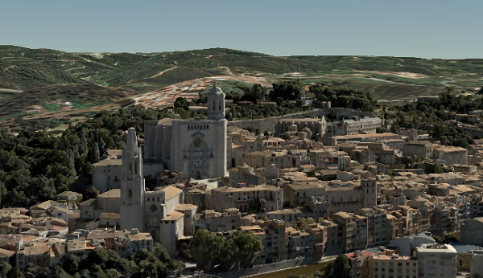

== Integrated Mesh Scene Layer (OGC Version 1.3)

Integrated mesh scene layers are generally created for citywide 3D
mapping. Integrated mesh scene layers include an entire surface and
cannot be restyled. Three-dimensional mesh data are typically captured
by an automated process (e.g. drone) for constructing 3D objects out of
large sets of overlapping imagery. The result integrates the original
input image information as a textured mesh including 3D objects, such as
buildings and trees, and elevation information.

*Examples*: Rancho Cucamonga Fire Station No. 3
https://3dcities.maps.arcgis.com/home/item.html?id=95a427c7a6ec4789b03c1a177366b54c)[SLPK].
Rancho Cucamonga Fire Station No. 3
https://3dcities.maps.arcgis.com/home/item.html?id=01eff699c8404a27a65e0877201136b4[service].

_Example of integrated mesh scene layer_

=== Integrated Mesh Scene Layer Structure

The Integrated Mesh scene layer is structured into a tree of multiple
JSON files. Integrated mesh scene layers can be represented as a scene
layer package (*.slpk) or a I3S service. A Integrated Mesh scene layer
contains the following:

* link:3DSceneLayer.cmn.adoc[3DSceneLayer]
* link:nodePage.cmn.adoc[nodePage]
* geometryBuffer (binary)
* textures (binary)
* link:sharedResource.cmn.adoc[sharedResource]*
* link:3DNodeIndexDocument.cmn.adoc[3DNodeIndexDocument]*

**Shared resources are deprecated as of OGC version 1.2 and are only
included for backwards compatibility.*

Integrated mesh scene layer packages can optionally contain a
link:slpk_hashtable.cmn.adoc[hash table] for faster indexing.

_Example of integrated mesh scene layer structure_

....
.<host>/SceneServer/layers
    +--0 // scene layer document
    +-- nodePages
    |  +-- 0
    |  +-- (...)
    +-- nodes
    |  +--0
    |  |  +-- geometries
    |  |  |  +-- 0
    |  |  |  +-- 1
    |  |  |  +--(...)
    |  |  +-- textures
    |  |  |  +-- 0
    |  |  |  +-- 1
    |  |  |  +--(...)
    |  |  +-- 3dNodeIndexDocument*
    |  |  +-- shared* 
    |  +-- (...)
....

_* Only required for OGC Version 1.1 compatability for older clients._

== HTTP API Overview OGC Version 1.3

OGC Version 1.3  is backwards compatible with Versions 1.2 and earlier. For any
clients to be able to read Version 1.1 files, sharedResources and the
3DNodeIndexDocument resource are included but not used in Version 1.2 and later.

The following API methods are available for integrated mesh scene layer:

*Scene layer document*

|===
|Type |JSON
|URL Template |http://serviceURL/layers/\{layerID}
|Example |http://my.server.com/IntegratedMeshSceneLayer/SceneServer/layers/0
|Description |This is the root document for the service containing properties common
to the entire layer. +
`layerID`: Integer. ID of the associated layer.
|===

link:3DSceneLayer.cmn.adoc[3DSceneLayer]

*Node page*

|===
|Type |JSON
|URL Template |`http://serviceURL/layers/{layerID}/nodepages/{nodePageID}/`
|Example |http://my.server.com/IntegratedMeshSceneLayer/SceneServer/layers/0/nodepages/1
|Description |`layerID`: Integer. ID of the associated layer. +
`nodePageID`: Integer. ID of the associated node page.
|===

link:nodePage.cmn.adoc[nodePage]

*Textures*

|===
|Type |JPG, PNG, DDS, KTX
|URL Template |http://serviceURL/layers/\{layerID}/nodes/\{nodeID}/textures/\{texture
ID}
|Example |http://my.server.com/IntegratedMeshSceneLayer/SceneServer/layers/0/nodes/9/textures/0_0_1
|Description |The texture resource (image). +
`layerID`: Integer. ID of the associated layer. +
`nodeID`: Integer. ID of the associated node. textureID: String. This ID returns one of the textures
available for this node. The same texture may be available in different formats.
|===

*Geometry*

|===
|Type |bin, draco
|URL Template |http://serviceURL/layers/\{layerID}/nodes/\{nodeID}/geometries/\{geometry
ID}
|Example |http://my.server.com/IntegratedMeshSceneLayer/SceneServer/layers/0/nodes/9/geometries/1
|Description |The geometry resource (mesh information). +
`layerID`: Integer. ID of the associated layer.  +
`nodeID`: Integer. ID of the associated node. +
`geometryID`: Integer. This ID returns one of the geometries available for this node. The same geometry may be available in a different format.
|===

=== HTTP API included for backward compatibility with OGC Version 1.1

*Shared resources*

|===
|Type |JSON
|URL Template |http://serviceURL/layers/\{layerID}/nodes/\{nodeID}/shared
|Example |http://my.server.com/IntegratedMeshSceneLayer/SceneServer/layers/0/nodes/9/shared
|Description |Legacy texture and material description. Not used in OGC Version 1.2. +
`layerID`: Integer. ID of the associated layer. +
`nodeID`: Integer. ID of the associated node.
|===

link:sharedResource.cmn.adoc[sharedResource]

*3D node index document*

|===
|Type |JSON
|URL Template |http://serviceURL/layers/\{layerID}/nodes/\{nodeID}
|Example |http://my.server.com/IntegratedMeshSceneLayer/SceneServer/layers/0/nodes/9
|Description |Description of the node. Not used in OGC Version 1.2. +
`layerID`: Integer. ID of the associated layer. +
`nodeID`: Integer. ID of the associated resource.
|===

link:3DNodeIndexDocument.cmn.adoc[3DNodeIndexDocument]
