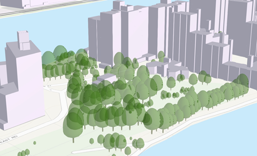

== Point Scene Layer (OGC Version 1.3)

Point scene layers contain point features and their attributes. Point
scene layers are often used to visualize large amounts of 3D data like
trees or buildings. Most phenomena that can be visualized by 3D symbols
can be displayed with a point scene layers.

*Examples*:

NYC 2015 Tree Survey
https://3dcities.maps.arcgis.com/home/item.html?id=d013ee07650d4a5192994b1fa1259a69[SLPK] +
NYC 2015 Tree Survey
https://3dcities.maps.arcgis.com/home/item.html?id=17b734b164ea47b1802a30ce0eb9c99f[service].

_Example of a point scene layer_

=== Point Scene Layer Structure

The point scene layer is structured into a tree of multiple JSON files.
Point scene layers can be represented as a scene layer package (*.slpk)
or a I3S service. A point scene layer contains the following:

* link:3DSceneLayer.psl.adoc[3DSceneLayer]
* link:nodePage.cmn.adoc[nodePages]
* link:featureData.cmn.adoc[featureData]
* attribute (binary)
* geometryBuffer (binary)
* link:3DNodeIndexDocument.cmn.adoc[3DNodeIndexDocument]
* link:statisticsInfo.cmn.adoc[statistics]
* link:resource.psl.adoc[resources]

_Example of point scene layer structure_

....
.<host>/SceneServer/layers
    +--0 // scene layer document
    +-- nodes
    |  +--root
    |  |  +-- attributes
    |  |  |  +--f_2
    |  |  |  +--f_4
    |  |  |  +--(...)
    |  |  +-- features
    |  |  |  +-- 0
    |  +-- (...)
    +--statistics
    |  +-- f_2
    |  | +--0
    |  +-- f_4
    |  | +--0
    |  +-- (...)
    +--resources
        +-- styles
        | +-- root
        | +-- web 
....

== HTTP API Overview

The following API methods are available for Point Scene Layer:

*Scene layer document*

|===
| Type | JSON
|URL Template |http://serviceURL/layers/\{layerID}
|Example | http://my.server.com/PointSceneLayer/SceneServer/layers/0
|Description |This is the root document for the service containing properties common
to the entire layer. layerID: Integer. ID of the associated layer.
|===

link:3DSceneLayer.psl.adoc[3DSceneLayer]

*3D node index document*

|===
| Type | JSON
|URL Template | http://serviceURL/layers/\{layerID}/nodes/\{nodeID}
|Example | http://my.server.com/PointSceneLayer/SceneServer/layers/0/nodes/98
|Description | Description of the node. +
layerID: Integer. ID of the associated layer. +
nodeID: Integer. ID of the associated resource.
|===

link:3DNodeIndexDocument.cmn.adoc[3DNodeIndexDocument]

*Attributes*

|===
| Type | JSON
|URL Template | http://serviceURL/layers/\{layerID}/nodes/\{nodeID}/attributes/f_\{attributeID}/0
|Example | http://my.server.com/PointSceneLayer/SceneServer/layers/0/nodes/98/attributes/f_8/0
|Description | The value for a specific attribute within a node. +
layerID: Integer. ID of the associated layer.  +
nodeID: Integer. ID of the associated resource. +
attributeID: Integer. ID of the specific attribute for the layer.
|===

*Feature*

|===
| Type | JSON
|URL Template | http://serviceURL/layers/\{layerID}/nodes/\{nodeID}/features/0
|Example | http://my.server.com/PointSceneLayer/SceneServer/layers/0/nodes/98/features/0
|Description | Point location and feature IDs. +
layerID: Integer. ID of the associated layer.  +
nodeID: Integer. ID of the associated resource. +
attributeID: Integer. ID of the specific attribute
for the layer.
|===

link:featureData.cmn.adoc[featureData]

*Geometry*

|===
| Type | bin, Draco
|URL Template | http://serviceURL/layers/{layerID}/nodes/{nodeID}/geometries/{geometryID}
|Example | http://my.server.com/PointSceneLayer/SceneServer/layers/0/nodes/98/geometries/0
|Description | The geometry resource (mesh information). +
`layerID` Integer. ID of the associated layer. +
`nodeID` Integer. ID of the associated node. +
`geometryID` Integer. This ID returns one of the geometries available for this node. The same geometry may be available in a different format. 
|===

The available gometry formats are specified in link:geometryDefinition.psl.adoc[geometryDefinitions] on the layer document.

*Statistics*

|===
| Type | JSON
|URL Template | http://serviceURL/layers/\{layerID}/statistics/f_\{attributeID}/0
|Example | http://my.server.com/PointSceneLayer/SceneServer/layers/0/statistics/f_8/0
|Description | The statistics for the entire layer for a specific attribute. layerID:
Integer. ID of the associated layer.  attributeID: Integer. ID of the specific attribute for the layer
|===

link:statisticsInfo.cmn.adoc[statistics]

*Resourses*

|===
| Type | JSON
|URL Template |http://serviceURL/layers/{layerID}/resources/styles/{resourceType}/resource/{uniqueId}
|Example | http://my.server.com/PointSceneLayer/SceneServer/layers/0/resources/styles/gltf/resource/5fe9e487e2230d61de71aff13744c5e9
|Description | A specific symbology resource. +
`layerID`: Integer. ID of the associated layer. +
`resourceType`: String. Possible values include JPEG, PNG, GLB.GZ +
`uniqueId`: Integer. Unique ID of the specific resource for the symbol
|===

link:resource.psl.adoc[resources]
