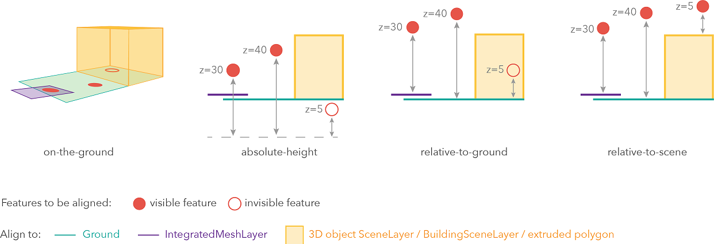

== elevationInfo [common profiles]

The elevationInfo defines how content in a scene layer is aligned to the ground. For example, the feature is on the ground or at an absolute height.

=== Related:

link:3DSceneLayer.cmn.adoc[cmn::3DSceneLayer],
link:3DSceneLayer.psl.adoc[psl::3DSceneLayer]

=== Properties

[cols=",,",options="header",]
|===
|Property |Type |Description
| mode | string | Determines how the service elevation values are combined with the elevation of the scene. Possible values are:

- `relativeToGround`: Features are placed at an elevation relative to the Ground or IntegratedMeshLayer. The feature's elevation is determined by summing up the elevation of the Ground or IntegratedMeshLayer and the geometry's z-value (if present).

- `absoluteHeight`: Features are placed at an absolute elevation (z-value) above sea level. This z-value is determined by the geometry's z-value (if present). +

- `onTheGround`: Features are aligned to the Ground. If the scene contains an IntegratedMeshLayer, then features are aligned to the IntegratedMeshLayer. +

- `relativeToScene`: Features are aligned to extruded polygons or 3D Object SceneLayers, depending on which one has higher elevation.

| offset | number | Offset is always added to the result of the above
logic except for onTheGround where offset is ignored. 
| unit | string | A string value indicating the unit for the values in elevationInfo 
|===

=== More information on `mode`

Defines how the feature is placed with respect to the terrain surface or 3D objects in the scene. If the geometry consists of multiple points (e.g. lines or polygons), the elevation is evaluated separately for each point. See below for diagrams showing each of the four allowed values. 



=== Example

```
{
  "elevationInfo": {
    "mode": "relativeToGround",
    "offset": 200,
    },
    "unit": "foot"
  }
}
```
