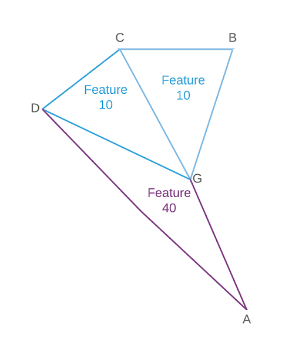
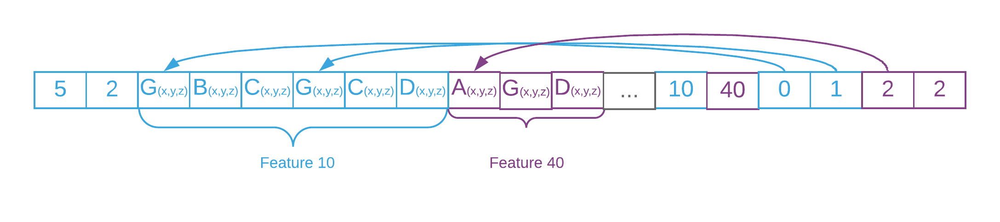

== geometryFaceRange

`faceRange` is an inclusive range of faces in this geometry that belongs
to this feature.

For each feature, `faceRange` indicates its first and last triangles as
a pair of integer indices in the face list.

*Notes*: - link:geometryFeatureID.cmn.adoc[`featureID`] attribute is
required - This attributes is only supported when topology is `triangle`
- Vertices in the geometry buffer must be grouped by `feature_id` - for
_un-indexed triangle meshes_, `vertex_index = face_index * 3`

*Example*

_Mesh with 2 features._

_Grouped vertices in the geometry buffer._

=== Related:

link:geometryBuffer.cmn.adoc[cmn::geometryBuffer] 

=== Properties

[cols=",,",options="header",]
|===
|Property |Type |Description
| *type* | string | Data type for the index range

Must be: `UInt32`

| *component* | integer | Pair of indices marking first and last
triangles for a feature. | encoding | string |

Must be: `none`

| binding | string |
Must be: `per-feature`

|===

_Note: properties in *bold* are required_

=== Examples

==== Example: FaceRange

[source,json]
----
 {
  "type": "UInt32",
  "component": 2
} 
----
