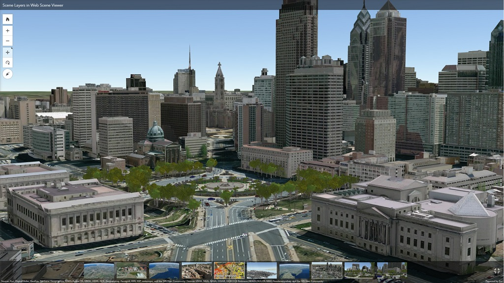

.Preface

I3S originated from investigations into technologies for rapidly
streaming and distributing large volumes of 3D content across enterprise
systems that may consist of server components, cloud hosted components,
and a variety of client software from desktop to web and mobile
applications.

////
*OGC Declaration*
////

////
[THIS TEXT IS ALREADY ADDED AUTOMATICALLY IN THE FRONTISPIECE OF ALL OGC DOUCMENTS]

Attention is drawn to the possibility that some of the elements of this document may be the subject of patent rights. The Open Geospatial Consortium shall not be held responsible for identifying any or all such patent rights.

Recipients of this document are requested to submit, with their comments, notification of any relevant patent claims or other intellectual property rights of which they may be aware that might be infringed by any implementation of the standard set forth in this document, and to provide supporting documentation.
////

[abstract]
== Abstract

[%unnumbered%]

The Indexed 3D Scene Layer (I3S) format is an open 3D content delivery
format used to rapidly stream and distribute large volumes of 3D GIS
data to mobile, web and desktop clients. I3S content can be shared
across enterprise systems using both physical and cloud servers. 

A single I3S data set, referred to as a Scene Layer, is a container for
arbitrarily large amounts of heterogeneously distributed 3D geographic
data. Scene Layers are designed to be used in mobile, desktop, and
server-based workflows and can be accessed over the web or as local
files.

The delivery format and persistence model for Scene Layers, referred to
as Indexed 3d Scene Layer (I3S) and Scene Layer Package (SLPK)
respectively, are specified in detail in this OGC Community Standard.
Both formats are encoded using JSON and binary ArrayBuffers (ECMAScript
2015). I3S is designed to be cloud, web and mobile friendly. I3S is
based on JSON, REST and modern web standards and is easy to handle,
efficiently parse and render by Web and Mobile Clients. I3S is designed
to stream large 3D datasets and is designed for performance and
scalability. I3S is designed to support 3D geospatial content and
supports the requisite coordinate reference systems and height models in
conjunction with a rich set of layer types.

The open community GitHub source for this Community Standard is
https://github.com/Esri/i3s-spec[here].

[.preface]
==  Source of this document

The majority of the content in this OGC document is a direct copy of the
content contained at https://github.com/Esri/i3s-spec . No normative
changes have been made to the content. This OGC document does contain
content not in the source Esri GitHub repository. Specifically, while
derived from content on the https://github.com/Esri/i3s-spec[Esri I3S
repository], the Abstract, Keywords, Preface, Submitting Organizations,
Endorsers, Terms and Definitions, and References sections and Annex B
(Bibliography) in this document are not found in the
https://github.com/Esri/i3s-spec[Esri I3S repository]. The Terms and
Definitions and References sections may be added into the Esri community
GitHub repository in the future.

NOTE: The OGC I3S source content can be found and viewed https://github.com/opengeospatial/ogc-i3s-community-standard repository[here]. If you wish to suggest changes, please create a branch. However, given that the Esri I3S Git repository is the source of the normative content, please also coordinate with the Esri I3S team.

[.preface]
== Validity of content

The Submission Team has reviewed and certified that the `snapshot`
content in this Community Standard is true and accurate. The `snapshot` for OGC I3S Version 1.3 was taken on April 23, 2022 from the Esri version 1.7 Git Repository.

[.preface]
== Supporting Organizations

The following organization support the submission of the I3S Community
Standard version 1.3 to the OGC:

[%unnumbered%]
[cols=",",options="header",]
|===
|Name |Affiliation
|Keith Ryden |Esri
|Carl Reed |Carl Reed & Associates
|Jerome Jacovella-St-Louis |Ecere
|Gordon Plunkett |Esri Canada
|Vijay Kumar |Esri India Technologies
|Anneley Hadland  | Helyx Secure Information Systems Ltd
|Volker Coors |Hochschule für Technik Stuttgart
|Clemens Portele | Interactive Instruments
|Jeongeun (Bomi) Lee | KoreaLand & Geospatial InformatiX Corporation
|Cesar Suarez, Hermann Brassard | Presagis
|Dean Hintz |Safe Software
|===

Note on supporting organizations. As per the OGC Technical Committee
Policies and Procedures:

* Any http://www.opengeospatial.org/standards/community[Community
Standard] submission requires that three or more distinct Member
organizations support the submission. In addition to the submission team
lead, each organization supporting the submission shall provide
the OGC with an email stating their organization’s support of the
submission.

Please note that all questions and/or comments regarding this OGC
Community Standard should be documented by submitting a GitHub issue in the https://github.com/opengeospatial/ogc-i3s-community-standard/issues[OGC I3S GitHub repository]. 

[.preface]
== Future Work 

The I3S community anticipates that revisions to this
Community Standard will be required to prescribe content appropriate to
meet new use cases. These use cases may arise from either (or both) the
external user and developer community or from OGC review and comments.
Further, future revisions will be driven by any submitted change
requests that document community uses cases and requirements.

