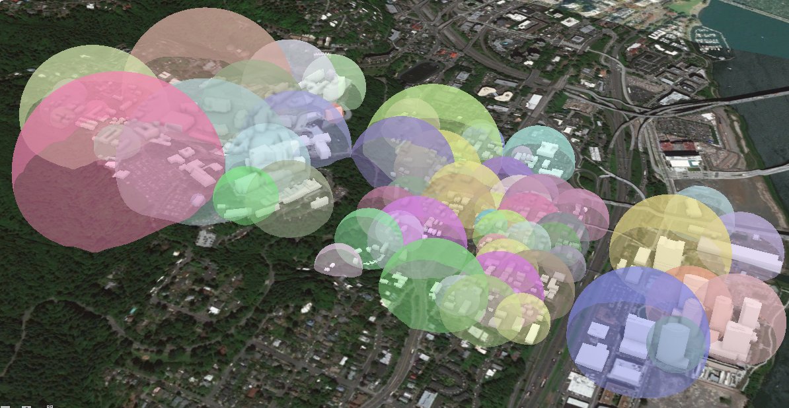
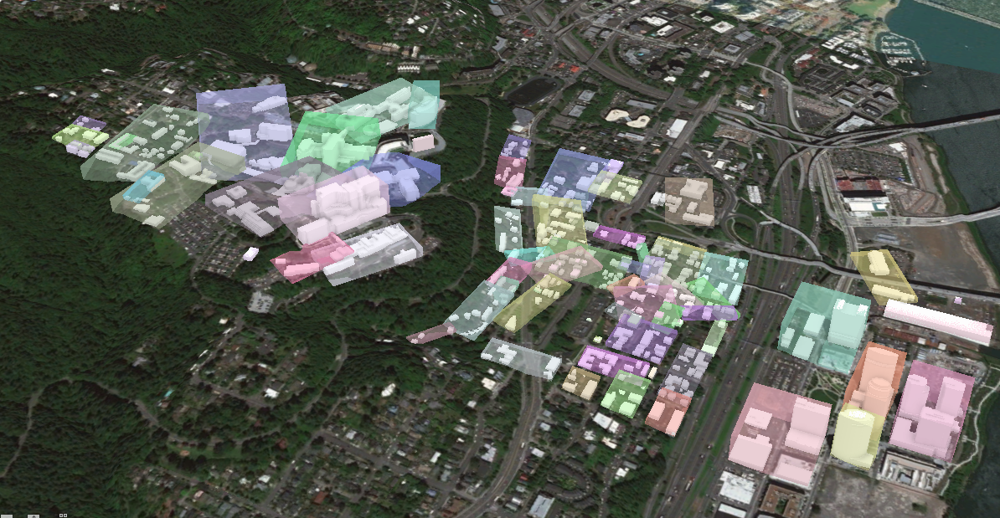
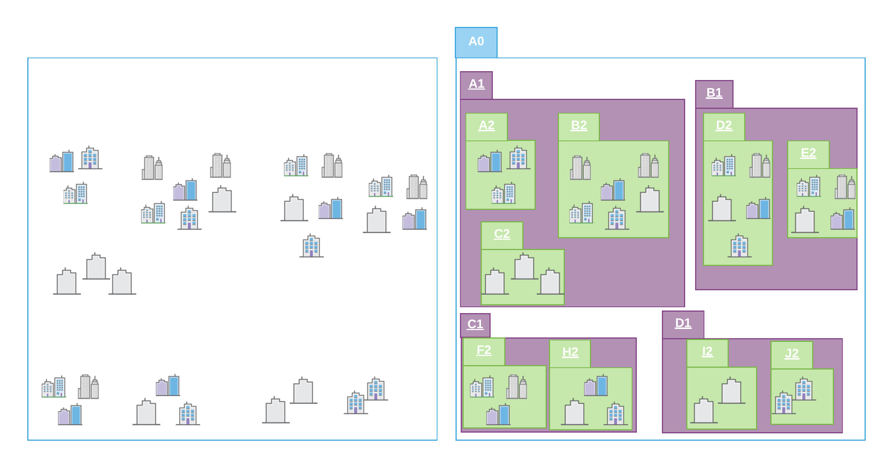

== I3S Standard - Normative

This section contains the normative clauses and requirements for implementing I3S. In the property tables, any property highlighted with a bold font is mandatory.

=== Coordinate Reference Systems

The I3S standard supports specifying the Coordinate Reference System and refers to two OGC standards for describing a CRS as Well Known Text. These are WKT1 as defined in the OGC Coordinate Transformation Service Standard (01-009) and WKT2 as defined in OGC Geographic Information – Well known text representation of coordinate reference systems (12-063r5). CRS as OGC Well Known Text was originally defined in clause 6.4 in the http://portal.opengeospatial.org/files/?artifact_id=13227[OGC Simple Features 99-036/ISO 19125] standard. 

I3S also supports specifying CRS in the ISO/OGC WKT standard http://docs.opengeospatial.org/is/12-063r5/12-063r5.html[ISO 19162:2015], Geographic information – Well-known text representation of coordinate reference systems. This new ISO/OGC Standard specifies an update to the original WKT representation. The two standards are referred to as WKT1 and WKT2 respectively.

==== (7.1.1)	A note on OGC Standards for CRS and Well Known Text. 

The two standards are referred to as WKT1 and WKT2

. WKT1: Refers to Well Known Text (WKT) for expressing a CRS as originally defined in clause 6.4 in http://portal.opengeospatial.org/files/?artifact_id=13227[OGC Simple Features [99-036/ISO 19125]. This original definition was extended in OGC Coordinate Transformation Service [01-009];
.	WKT2: Refers to WKT as defined in OGC WKT CRS/ISO 19162:2015 Geographic information -- Well-known text representation of coordinate reference systems [12-063r5]. From the document, “This Standard provides an updated version of WKT representation of coordinate reference systems that follows the provisions of ISO 19111:2007 and ISO 19111-2:2009. It extends the earlier WKT to allow for the description of coordinate operations.”

The text in this paragraph is extracted verbatim from 12-063r5. OGC 12-063r5 makes several references to backward compatibility. “Backward compatibility means that an implementation of the text strings in this International Standard would be able to read CRS WKT strings conforming to the old (ISO 19125-1:2004) syntax. It does not mean that a parser of a string compliant to ISO 19125-1:2004 could read WKT strings written in conformance with this International Standard. It also does not require an implementation of the text strings in this International Standard to be able to output an object according to the old syntax. Annex B.8 gives guidance on determining the version of a CRS WKT string. A mapping of older syntaxes to this International Standard is given in Annex C.”

Please note that in an I3S implementation the CRS MAY be represented using either WKT1 or WKT2. While WKT1 has been in use for many years, WKT1 has been superseded by WKT2. Although implementations of OGC standards using WKT2 are not yet widely available the guidance from the OGC/ISO community is to implement WKT2. Important Note: WKT1 does not support explicit definition of axis order.

Therefore, _*I3S implementers need to note for their implementations if they support WKT1 only or both (as WKT2 requires continued support of WKT1)*_.

==== CRS Use and Requirements in I3S

Indexed 3D Scene Layers have to fulfill a number of requirements when it comes to the selection of Coordinate Reference Systems (CRS) to use:

-	Minimize the need for re-projection on the client side
-	Support data sets with a global extent
-	Render easily in coordinate reference systems for projected CRSs as well as for geographic CRSs
-	Support local and global data with very high positional accuracy.

_NOTE:_ A Projected CRS is defined on a flat, two-dimensional surface. Unlike a Geographic CRS, a Projected CRS has constant lengths, angles, and areas across the two dimensions. A Projected CRS is always based on a Geographic CRS that is based on an ellipse. Geographic CRSs are based on a Geodetic datum. The EPSG dataset contains three subtypes of Geodetic CRS: Geocentric, Geographic 3D, Geographic 2D. ISO 19111 Compliance Note: In ISO19111, geog2D, geog3D and geocentric are all considered to be "geodetic CRSs".

These use cases lead to the following implementation requirements. Note that all I3S profiles support writing 3D content in two modes: global and local. In global mode, only the geographic CRS WGS84 (EPSG 4326) is supported for both index and vertex positions.

- The location of all index-related data structures such as node bounding spheres SHALL be specified using a single, global geographic WGS 84 CRS. Coordinate bounds for such structures SHALL be in the range (-180.0000, -90.0000, 180.0000, 90.0000). Height and node minimum bounding sphere (MBS) radius SHALL be specified in meters. Allowed CRS specified using an EPSG code is EPSG:4326 
- All vertex positions SHALL be specified using a geodetic CRS (including Cartesian coordinate reference systems), where x,y,z axes are all in same unit, and with a per-node offset (from the center point of the node's minimum bounding sphere) for all vertex positions. 
- Axis Order: Axis order explicitly defined by the CRS SHALL be used when present. When the axis order is not defined by the CRS, Easting, Northing, Height axis order SHALL be used. The Height axis SHALL always point upwards towards the sky (away from the center of the earth).

All I3S layers indicate the coordinate system used by the layer with the <<spatialReference>> property in the 3dSceneLayerInfo resource. This property is normative.

The spatial reference object is common to all I3S profile types.

=== Height Models

The I3S standard accommodates declaration of a vertical coordinate reference system that may either be ellipsoidal (height defined with respect to a reference ellipsoid) or gravity-related height (height defined with respect to a reference geoid/gravity surface). This allows the I3S approach to be applied across a diverse range of fields and applications where the particular definition of height is of importance. 
 
The Well-known Text (WKT) string representation of the CRS now includes the vertical coordinate reference system utilized by the layer. The _spatialReference_ property also includes a well-known Id (wkid) and a Vertical Coordinate Reference System Well-known ID (_vcsWkid_) representation, which could alternatively be utilized by a client application consuming the layer instead of the WKT. In addition to the detailed _spatialReference_ property that describes the layers horizontal and vertical CRSs, the 3dSceneLayerInfo resource also includes a coarse metadata property called _heightModelInfo_, which can be used by a client application to quickly identify if the layers' height model is either gravity-related or ellipsoidal.

The following is a WKT1 description of WGS 84, EPSG 4326.

```
    
"spatialReference": // the horizontal and vertical coordinate reference system of the layer
    {
        "wkid": 4326,
        "latestWkid": 4326,
        "vcsWkid": 3855,
        "latestVcsWkid": 3855,
        "wkt": "GEOGCS[\"GCS_WGS_1984\",DATUM[\"D_WGS_1984\",SPHEROID[\"WGS_1984\",6378137,298.257223563]],PRIMEM[\"Greenwich\",0],UNIT[\"Degree\",0.017453292519943295]],
        VERTCS[\"EGM2008_Geoid\",VDATUM[\"EGM2008_Geoid\"],PARAMETER[\"Vertical_Shift\",0.0],PARAMETER[\"Direction\",1.0],UNIT[\"Meter\",1.0]]}"
    }
```

The following is a WKT2 description of a compound WGS 84, EPSG 4326 and EPSG 3855.

```
COMPOUNDCRS ["I3S Compound CRS",
GEODCRS["WGS 84",
  DATUM["World Geodetic System 1984",
    ELLIPSOID["WGS 84",6378137,298.257223563,LENGTHUNIT["metre",1.0]]],
  CS[ellipsoidal,2],
    AXIS["latitude",north,ORDER[1]],
    AXIS["longitude",east,ORDER[2]],
    ANGLEUNIT["degree",0.01745329252],
  ID["EPSG",4326]]
VERTCRS["EGM2008 height",
  VDATUM["EGM2008 geoid"],
  CS[vertical,1],
    AXIS["gravity-related height (H)",up],
    LENGTHUNIT["metre",1.0],
  ID["EPSG",3855]]]
```

The following is an example of heightModelInfo.

```
HeightModelInfo

    "heightModelInfo":  // a coarse metadata indicating the layers height Model
    {
        "heightModel": "gravity_related_height", //one of {*" gravity_related_height"*, "ellipsoidal"};
        "ellipsoid": "wgs84 (G1674)/", //datum realization
        "heightUnit": "meter" //units
        }
```

The above examples illustrate the coordinate reference system and height model of a layer in an I3S payload. The _spatialReference_ object includes a Well-known Text (WKT) string representation of the CRS for both horizontal and vertical coordinate reference systems. The examples provided above show both WKT1 and WKT2 WKT encodings as defined in OGC 12-063r5 - either may be encoded in the spatialReference object. The _heightModelInfo_ object is coarse metadata that could be used by client application to quickly determine if the layers' horizontal and vertical coordinate reference systems align with that of any base map data used by the application. 

See Class 3dSceneLayerInfo (Clause 7.5.4) for more information on the use of the heightModelInfo object.

== Organization and Structure 

=== Tree Structure 

To ensure high performance when visualizing 3D content, data are
spatially grouped into link:#Nodes[nodes]. The grouping process is
repeated recursively to create a tree of nodes. The spatial extent of a
given node encompasses all its children to create a bounding volume
hierarchy. Both spatially regular (e.g. quadtree) as well as spatially
irregular (e.g. R-tree) organizations of data are supported.

The bounding volume is defined either as minimum bounding sphere (MBS)
or oriented bounding box (OBB) representation.

_3D objects enclosed in minimum bounding spheres._


_3D objects enclosed in the smallest bounding box._


OBB is the more optimal representation and implementers are encouraged
to output node bounding volumes in OBB format. Point cloud profile
supports OBB representation only.

In order to provide a scalable representation of the original data,
parent nodes contain a simplified representation of their children
creating link:LevelofDetail.adoc[Level of Details].



_Schematic view of spatially distributed data and recursive grouping of
nodes into a bounding volume hierarchy._

image:../images/BoundingVolumeHierarchyTree.png[Bounding volume
hierarchy represented as a tree of nodes.]

_Example of bounding volume hierarchy represented as a tree of nodes._

=== Nodes 

In a Scene Layer, data are spatially grouped into nodes. The nodes
contain node resources for the bounding volume. Each node has a unique
identifier, which allows clients to efficiently locate and load the
resources.

==== Feature 

A feature represents a real-world object within a node. For example, an
individual point in a point scene layer or a building within a 3D object
scene layer. Node resources such as geometry buffer and attributes can
belong to a feature and can be accessed by an object-ID.

When the same feature is included in more than one node at different
link:LevelofDetail.md[Levels of Detail], the corresponding attributes
for the feature are included as attribute resources in each node. This
redundancy in attribute storage allows each node to be rendered
independently of other nodes. The following scene layer types support
features:

[cols=",,,,",options="header",]
|===
|Feature |Integrated Mesh |3D Object |Points |Point Clouds
|support |  |image:../images/checkmark.png
|image:../images/checkmark.png | 
|===

==== Node resources 

In addition to a bounding volume, each node contains references to node
resources. The type of resource available, such as geometry buffer,
texture and attribute, depends on the original data and layer type.
Clients must use the resource identifiers (id) written in each node to
access the resources. While content creators may choose to match a
resource id with the node id this is not required by the I3S
specification. As such, clients should not make this assumption.

[cols=",,,,",options="header",]
|===
|Node Resources |Integrated Mesh |3D Object |Points |Point Clouds
|geometry buffer | image:../images/checkmark.png[yes] |image:../images/checkmark.png[yes] |  |image:../images/checkmark.png[yes]

|attribute |  |image:../images/checkmark.png[yes] |image:../images/checkmark.png[yes] |image:../images/checkmark.png[yes]

|texture |image:../images/checkmark.png[yes] |image:../images/checkmark.png[yes] |  | 
|===


_Node resource for backward compatibility with 1.6_

[cols=",,",options="header",]
|===
|Node Resources |Integrated Mesh |3D Object
|sharedResources |image:images/checkmark.png[yes]
|image:../images/checkmark.png[yes]

|3dNodeIndexDocument |image:images/checkmark.png[yes]
|image:../images/checkmark.png[yes]
|===

_Note: All binary data is stored in little endian._

===== Geometry 

Depending on the scene layer type and the version of I3S, different
geometry representations are used. For example, an integrated mesh scene
layer geometry data includes all vertex attributes, feature counts, and
mesh segmentation.

In I3S version 1.7 3D Objects and Integrated Mesh scene layer are using
link:../docs/1.7/geometryBuffer.cmn.md[geometryBuffer] with draco
compression to describe the geometry. Previous versions of 3D Object and
Integrated Mesh scene layers (1.6 and earlier) define geometry in the
link:../docs/1.6/defaultGeometrySchema.cmn.md[defaultGeometrySchema].
The expected triangle/face winding order in all geometry resources is
counterclockwise.

Point and Point cloud layers model geometries as points. Point scene
layer define the geometry in
link:../docs/1.6/featureData.cmn.md[featureData]. For a Point Cloud
Scene Layer the binary
link:../docs/2.0/defaultGeometrySchema.pcsl.md%22[geometry] is lepcc-xyz
compressed.

===== Attributes 

Attribute data for all features in a node are represented as discrete,
per field resource called attribute. Attributes are used to visualize or
query features within a scene layer. For example, each attribute
resource, such as land use codes, can be assigned to a unique color to
visualize the different types of land use in the scene layer. The number
of attribute resources corresponds to the number of fields in the scene
layer.

Attributes values are stored in the attribute resource in the same order
as feature geometries are in the geometry buffer. This allows clients to
render each node efficiently through direct array access instead of
object-id based attribute lookups.

Metadata on each attribute resource is made available to clients via the
scene service layer. When attributes are present within the scene layer,
additional metadata in the link:../docs/1.7/field.cmn.md[fields] array
and link:../docs/1.7/attributeStorageInfo.cmn.md[attributeStorageInfo]
array further describe each attribute resource. The
link:../docs/2.0/attributeInfo.pcsl.md[attributeInfo] of the Point Cloud
scene layer contains the description of the attributes.

===== Textures 

The texture resource contains texture image files. Textures are stored
as a binary resource. Individual textures should be aggregated into
texture atlases (An image containing a collection of smaller images.).
Client capabilities for handling complex UV cases may vary, so texture
coordinates are used. Texture coordinates do not take atlas regions into
account directly. The client is expected to use the sub-image region
values and the texture coordinates to best handle repeating textures in
atlases.

For more details, see the link:../docs/1.7/texture.cmn.md[texture] and
link:../docs/1.7/textureSetDefinition.cmn.md[textureSetDefinition].

==== Node resources for I3S 1.6 and earlier 

To ensure backward compatibility with 1.6 clients, a 1.7 scene layer
needs to also include the
link:../docs/1.7/3DNodeIndexDocument.cmn.md[3dNodeIndexDocument]
resource as well as the
link:../docs/1.7/sharedResource.cmn.md[sharedResources] available for
any node. SharedResource includes the material definition of the node.

=== Node Page 

In version 1.6 and earlier, each node is stored individually as a
3DNodeIndexDocument, causing the tree traversal performance to be
negatively impacted due to the large number of small resource requests
required. Version 1.7 packs many nodes into a single resource called a
node page. These node pages are created by representing the tree as a
flat array of nodes where internal nodes reference their children by
their array indices.

I3S creators are free to use any ordering (e.g. breadth first, depth
first) of the nodes into a flat array of nodes. In version 1.7, the ID
for a node is an integer that represents the index of the node within
this flattened array.

image:../docs/img/BoundingVolumeHierarchyTree.png[bounding volume
hierarchy tree] image:../docs/img/NodePageArray.png[node page]

_Example of breadth first ordering of nodes in a flat array. Children
nodes are addressed by their index in the array._

=== Statistics 

link:../docs/1.7/stats.cmn.md[Statistics] are used by clients to define
symbology without having to read all data. For example, if you want to
define a unique value symbology, statistics are used to collect all
unique values within the layer and calculate the number of features that
are included in a unique value. Beside symbology, statistics are also
used to filter data.

=== Coordinate Reference Systems 

The I3S specification supports specifying the Coordinate Reference
System (CRS) as a Well Known Text, as defined in clause 6.4 in OGC
Simple Features
http://portal.opengeospatial.org/files/?artifact_id=13227[99-036/ISO
19125] standard. I3S also supports specifying CRS in the WKT standard
http://docs.opengeospatial.org/is/12-063r5/12-063r5.html[CRS/ISO
19162:2015], Geographic information – Well-known text representation of
coordinate reference systems, which provided an update to the original
WKT representation. The two standards are referred to as WKT1 and WKT2
respectively.

In I3S implementation the CRS may be represented using either WKT1 or
WKT2. While WKT1 has been in use for many years, WKT1 has been
superseded by WKT2. Although implementations of OGC standards using WKT2
are not yet widely available, the guidance from the OGC/ISO community is
to implement WKT2.

WKT1 does not support explicit definition of axis order. Therefore, I3S
implementers need to note for their implementations if they support WKT1
only or both (as WKT2 requires continued support of WKT1). In addition,
please note that not all ArcGIS clients support WKT2 yet.

The Coordinate Reference System (CRS) of the Indexed 3D Scene Layer
should be selected with the following considerations:

* Minimize the need for re-projection on the client side.
* Render in both geographic and projected coordinate reference systems.
* Support data with a global extent.
* Support local and global data with high positional accuracy.

All I3S profiles support writing 3D content in two modes: _global_ and
_local_. In global mode, only the geographic CRS WGS84, as identified by
its EPSG code 4326, and GCS China Geodetic Coordinate System 2000, as
identified by its EPSG code 4490, are supported for both index and
vertex positions. It is represented using longitude, latitude and
elevation. In local mode, all other geodetic CRS, including projected
coordinate systems, are allowed.

In both modes, node index and position vertex must have the same CRS. In
addition, all vertex positions are specified as an _offset_ from a
node’s Minimum Bounding Volume (MBV) center. The MBV could be specified
as a Minimum Bounding Sphere (MBS) or as an Oriented Bounding Box (OBB).

All vertex positions SHALL be specified using a geodetic CRS (including
Cartesian coordinate reference systems), where x,y,z axes are all in
same unit, and with a per-node offset (from the center point of the
node’s minimum bounding sphere) for all vertex positions.

Axis Order: Axis order explicitly defined by the CRS SHALL be used when
present. When the axis order is not defined by the CRS, Easting,
Northing, Height axis order SHALL be used. The Height axis SHALL always
point upwards towards the sky (away from the center of the earth).

As a result, for an I3S layer to be in a _global_ mode the following
requirements must be met:

The location of all vertex positions and index-related data structures,
such as the nodes minimum bounding volume, are specified using the
geographic CRS WGS84 or CGCS 2000, where:

* The only supported CRS in this mode is EPSG code, 4326 and 4490.
* X and Y coordinate bounds of the layer and XY components of the vertex
position are specified in decimal degrees.
* Elevation (the z component of the vertex position) is specified in
meters.
* The Minimum Bounding Volume (MBV) radius unit (for MBS) or halfSize
unit (for OBB) is specified in meters.

For an I3S layer to be in a _local_ mode the following requirements must
be met:

All vertex positions are specified using geodetic CRS, identified by an
EPSG code. Any CRS with an EPSG code _other_ than 4326 or 4490 will be
treated as in a local mode.

* All three components of a vertex position (XYZ) and the Minimum
Bounding Volume (MBV) radius (for MBS) or halfSize (for OBB) need to be
in the same unit.

The link:../docs/1.7/spatialReference.cmn.md[spatial reference] object
is common to all I3S profile types.

=== Height Models 

I3S supports either ellipsoidal (height defined with respect to a
reference ellipsoid) or gravity-related (height defined with respect to
a reference geoid) vertical coordinate systems. This allows I3S to be
applied across a diverse range of fields and applications.

At version 1.5, I3S added support for vertical coordinate systems. The
Well Known Text (WKT) representation of the Coordinate Reference System
now includes the vertical coordinate system used by the layer. The
link:../docs/1.7/spatialReference.cmn.md[spatial reference] object also
includes a Well-known ID (WKID) and a Vertical Coordinate System
Well-known ID (VcsWKID). The client can consume any of these properties
to designate the height model.

The heightModelInfo, included in the 3DSceneLayerInfo resource, is used
by clients to determine if the layer’s height model is orthometric or
gravity-related.

== I3S Services 

A RESTful API allows access to I3S scene layers. Each scene layer
profile has different components and features. For details on the API of
a specific profile and version, refer to the individual README
documents.

Version 1.7 support for link:../docs/1.7/3Dobject_ReadMe.md[3D Objects]
and link:../docs/1.7/IntegratedMesh_ReadMe.md[Integrated Mesh].

Version 1.6 support for link:../docs/1.6/3Dobject_ReadMe.md[3D Objects],
link:../docs/1.6/IntegratedMesh_ReadMe.md[Integrated Mesh], and
link:../docs/1.6/Point_ReadMe.md[Point].

Version 2.0 support for link:../docs/2.0/pcsl_ReadMe.md[Point Cloud].

== I3S Formats 

=== Scene Layer Packages 

Scene Layer Package (SLPK) consolidates an I3S layer into a single file.
SLPKs are designed to be directly consumed by applications.

An SLPK is a https://en.wikipedia.org/wiki/Zip_(file_format)[zip]
archive containing compressed files and resources. The compression level
for a SLPK file is not compressed. For example, if using 7-zip to create
a scene layer package the compression level is `STORE`. The individual
resources within the SLPK may be compressed using the compression method
`GZIP`. For example, `.json.gz`. The exception is for jpg and png files.
We recommend compressing all resources.

Both 64-bit and 32-bit zip archives are supported. 64-bit is required
for datasets larger than 2GB.

Please note that this method is slightly different than a typical zip
archive. In general, when a file is added to a zip archive, the new file
is individually compressed, and the overall archive is compressed. *That
is not the case for SLPK.* When adding files to an SLPK, the new file is
compressed, but the overall archive remains uncompressed and is archived
using compression level not compressed (`STORE`).

This is an example of a geometry resource opened in 7-zip. Notice that
both the Size and the Packed Size are equal. The method is `STORE`.

image:images/slpk_archive_store.PNG[Example of compressed geometry
resource with size and method] _Compressed geometry resource with size
and method._

*File Extensions*

SLPK require file extensions to determine the file type.

Here are a few examples of SLPK file extensions:

* .jpg
* .png
* .bin.dds
* .json

*Hash*

In I3S verison 1.7, an https://en.wikipedia.org/wiki/MD5[MD5]
link:../docs/1.7/slpk_hashtable.cmn.md[hash] is used to improve loading
time. The hash must be the last item at the end of the central directory
and named `@specialIndexFileHASH128@`.

==== Example 1.7 SLPK Structure Summary for 3D Objects 

....
.\example_17.slpk
    +--nodePages
    |  +--0.json.gz
    |  +-- (...)
    +--nodes
    |  +--root
    |  |  +--3dNodeIndexDocument.json.gz
    |  +--0
    |  |  +--attributes
    |  |  |  +--f_0
    |  |  |  |  +--0.bin.gz
    |  |  |  +--(...)
    |  |  +--features
    |  |  |  +-- 0.json.gz
    |  |  |  +--(...)
    |  |  +--geometries
    |  |  |  +-- 0.bin.gz
    |  |  |  +--(...)
    |  |  +--textures
    |  |  |  +--0.jpg
    |  |  |  +--0_0_1.bin.dds.gz
    |  |  |  +--(...)
    |  |  +--shared
    |  |  |  +--sharedResource.json.gz
    |  |  + 3dNodeIndexDocument.json.gz
    |  +--(...)
    +--statistics
    |  +--f_1
    |  |  +--0.json.gz
    |  +--(...)
    +--3dSceneLayer.json.gz
    +--@specialIndexFileHASH128@
....

Paths are the same as in the API, but without the `layers/0` prefix.
Exceptions are:

[width="100%",cols="37%,21%,42%",options="header",]
|===
|Resource |SLPK |Service
|Scene layer document |3dSceneLayer.json.gz |layers/0

|Legacy node resource |/nodes/4/3dNodeIndexDocument.json.gz
|layers/0/nodes/4

|Legacy shared resource |/nodes/4/shared/sharedResource.json.gz
|layers/0/nodes/4/shared
|===

#### Example 1.6 Structure Summary for 3D Objects

....
.\example_16.slpk
    +--nodes
    |  +--root
    |  |  +--3dNodeIndexDocument.json.gz
    |  +--0
    |  |  +--attributes
    |  |  |  +--f_0
    |  |  |  |  +--0.bin.gz
    |  |  |  +--(...)
    |  |  +--features
    |  |  |  +--0.json.gz
    |  |  |  +--(...)
    |  |  +--geometries
    |  |  |  +--0.bin.gz
    |  |  |  +--(...)
    |  |  +--textures
    |  |  |  +--0.jpg
    |  |  |  +--0_0_1.bin.dds.gz
    |  |  |  +--(...)
    |  |  +--shared
    |  |  |  +--sharedResource.json.gz
    |  |  +--3dNodeIndexDocument.json.gz
    |  +--0-0
    |  |  +--(...)
    |  +--0-0-0
    |  |  +--(...)
    |  +--1
    |  |  +--(...)
    |  +--1-0
    |  |  +--(...)
    |  +--1-0-0
    |  |  +--(...)
    |  +--(...)
    +--statistics
    |  +--f_1
    |  |  +--0.json.gz
    |  +-- (...)
    +--3dSceneLayer.json.gz
    +--metadata.json
....

**Metadata**

Scene layer packages (SLPK) contain metadata information regarding its
content in the metadata.json file. The following entries are required
and must be of the specified type.

[width="100%",cols="54%,46%",options="header",]
|===
|Property |Details
|_folderPattern_ |One of \{BASIC, EXTENDED}, Default is \{BASIC}

|archiveCompressionType |One of \{STORE, DEFLATE64, [DEFLATE]}, Default
is \{STORE}

|resourceCompressionType |One of \{GZIP, NONE}, Default is \{GZIP}

|I3SVersion |One of \{1.2, 1.3, 1.4, 1.6, 1.7, 2.0}, Default is \{1.7}
(Point cloud is \{2.0})

|nodeCount |Total number of nodes in the SLPK
|===

*Example of 1.7 Metadata json*

....
.\metadata.json
{
    "folderPattern":"BASIC",
    "archiveCompressionType":"STORE",
    "resourceCompressionType":"GZIP",
    "I3SVersion":"1.7",
    "nodeCount":62
}
....

*Example of 2.0 Metadata json*

....
.\metadata.json
{
    "folderPattern":"BASIC",
    "archiveCompressionType":"STORE",
    "resourceCompressionType":"GZIP",
    "I3SVersion":"2.0",
    "nodeCount":1156
}
....

